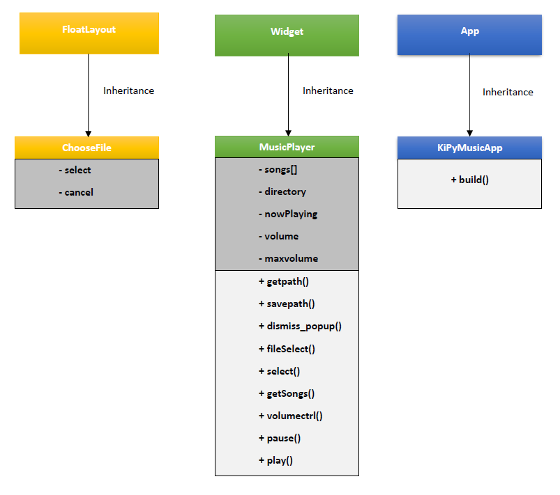

# Dokumentasi dan Konsep OOP pada Program KiPyMusicPlayer

## Global Variabel
+ Config.set('graphics', 'fullscreen', '0')

## Class and Method
### 1. Class ChooseFile
Kelas ini berfungsi untuk memilih direktori music yang ada di direktori file untuk dimasukkan ke dalam playlist. Kelas ini inheritance terhadap class **kivy.uix.floatlayout.FloatLayout**.
Di dalam kelas ini terdapat 2 attribut yaitu atribut:
+ **-select** :

  Berfungsi untuk memilih direktori music yang dimaksud

+ **-cancel** :

  Berfungsi untuk membatalkan perintah

### 2. Class MusicPlayer
Kelas ini berfungsi sebagai kelas utama/root. Kelas ini inheritance terhadap class kivy.uix.widget.Widget.
Di dalam kelas ini terdapat 5 attribut yaitu atribut:
+ **-songs** :

  Atribut ini berbentuk list, karena berfungsi untuk menampung lagu/musik yang akan dijalankan.

+ **-directory** :

  Atribut ini berfungsi untuk mendefinisikan direktori file yang sedang dipilih.

+ **-nowPlaying** :

  Atribut ini berfungsi untuk mendefinisikan musik yang sedang di jalankan saat ini.

+ **-volume** :

  Atribut ini berfungsi untuk mendefinisikan volume musik dengan default 0. 

+ **-maxvolume** :

  Atribut ini berfungsi untuk mendefinisikan maxsimum volume musik.

Di dalam kelas ini terdapat 9 method yaitu method:

+ **+getpath()**      :

  Method ini berfungsi untuk membuat file dat untuk menyimpan playlist lagu/musik yang akan diputar. 
  
+ **+savepath()**     :

  Method ini berfungsi untuk menyimpan playlist lagu/musik ke dalam file dat yang telah dibut di method getpath() tadi.
  
+ **+dismiss_popup()**  :

  Method ini agar tidak muncul popup
  
+ **+fileSelect()**     :

  Method ini berfungsi untuk memilih file directory musik yang akan dimasukkan ke dalam playlist dengan memanggil(inheritance) dari kelas ChooseFile.
  
+ **+select()**         :

  Method ini berfungsi untuk memilih file lagu/musik dari direktory yang sudah dipilih pada method fileSelect tadi.
  
+ **+getSongs()**       :

  Method ini berfungsi untuk memainkan lagu/musik yang sudah dipilih pada method select.
  
+ **+volumectrl()**     :

  Method ini berfungsi untuk mengatur volume lagu/musik
  
+ **+pause()**          :

  Method ini berfungsi untuk pause lagu/musik
  
+ **+play()**           :

  Method ini berfungsi untuk memainkan lagu/musik yang sedang di pause

### 3. Class KiPyMusic

Kelas ini berfungsi untuk menjalankan aplikasi/software. Di dalam kelas ini hanya terdapat 1 method, yaitu method **+build()** untuk menjalankan aplikasi/software KiPyMusic ini dengan memanggil dari class **MusicPlayer**. Kelas ini 
inheritance terhadap class **kivy.app.App**.

# Konsep - Konsep OOP yang ada pada Program KiPyMusicPlayer

## 1. Class :

Class adalah Struktur data yang digunakan untuk mendefinisikan object yang menyimpan data beserta nilai-nilai dan perilakunya (behavior).

Class adalah suatu entitas yang merupakan bentuk program dari suatu abstraksi untuk permasalahan dunia nyata, dan instans dari class merupakan realisasi dari beberapa objek.

Class adalah wadah/cetakan untuk menciptakan object-object

Class adalah Struktur data yang bisa digunakan untuk membuat object.

## 2. Instance (Instansiasi)

Instance(Instansiasi) dari class Jika class secara umum merepresentasikan (template) sebuah object, maka sebuah instance adalah representasi nyata dari class itu sendiri.

## 3. Object

Object adalah Class yang sudah diisi.

Object adalah Hasil ciptaan dari class.

## 4. Default(pass)

Adalah menurunkan semua properti dan method dari class induk (parent class) ke anak class (subclass).

## 5. Inheritance Class

Suatu class dapat mewarisi fungsi dari class lain. Jika sebuah object diciptakan menggunakan class yang mewarisi dari superclass, maka objek akan berisi method dari gabungan kedua kelas, yaitu kelas itu sendiri dan superclass.

Suatu class dikatakan mewarisi class lain adalah ketika class tersebut memakai property atau method dari class lain. Misalnya dalam hal biologi, kita dapat memikirkan seorang anak yang mewarisi sifat-sifat tertentu dari orang tuanya. seperti, seorang anak dapat mewarisi warna mata atau tinggi orang tua.

## 6. Override Inheritance

Mengganti / memodifikasi properti atau method ataupun properti dan method yang diturunkan dari class induk (parent class).

## 7. Super Inheritance

Menambahkan properti dari class induk (parent class) -> boleh memakai super() ataupun nama class induknya.

**Pada program KiPyMusicPlayer**
+ Class ChooseFile karena menambahkan properti dari class kivy.uix.floatlayout/(FloatLayout)
+ Class MusicPlayer karena menambahkan properti dari class kivy.uix.widget/(Widget)
+ Class KiPyMusicApp karena menambahkan properti dari class kivy.app/(App)

## 8. Multiple Inheritance

Adalah ketika subclass memakai atau menambahkan properti / method dari 2 atau lebih class lain

## 9. Polymorphisme

Adalah cara membuat struktur yang dapat mengambil atau menggunakan banyak bentuk objek.

## 10. Overloading

Adalah sebuah method yang memiliki parameter dan method tersebut bisa mempunyai nama method yang sama dengan method yang lain dengan syarat jumlah parameter harus berbeda, atau dengan kata lain situasi di mana beberapa method dalam sebuah class dapat mempunyai nama yang sama tetapi berbeda jenis parameter,jumlah parameter, dan/atau jenis return value.

## 11. Encapsulation

Adalah cara untuk menyembunyikan properti dan method di dalam sebuah class agar properti dan method tersebut tidak dapat diakses oleh class lain.

# About KiPyMusicPlayer
Music Player sederhana yang dibangun dengan library python-kivy.
* Mencari dan memainkan musik berformat mp3, m4a, ogg
* GUI yang menarik.

source : https://github.com/JasonHinds13/KVMusicPlayer

## Screenshot Aplikasi

#### Screenshot 1

#### Screenshot 2

#### Screenshot 3

#### Screenshot 4

