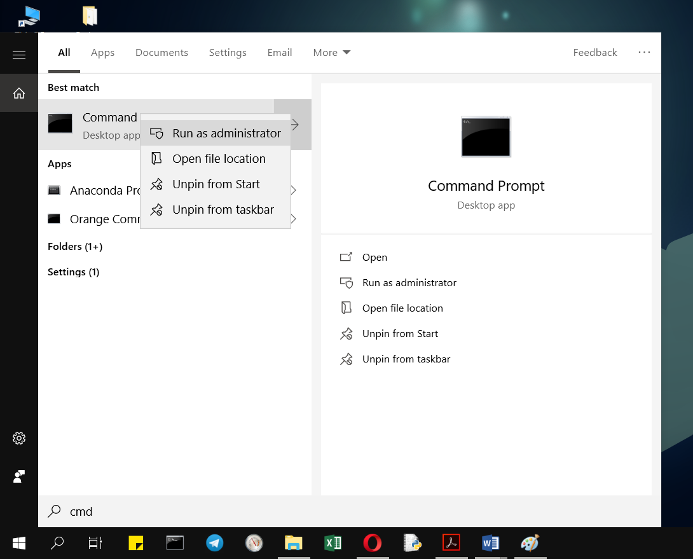
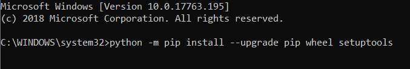
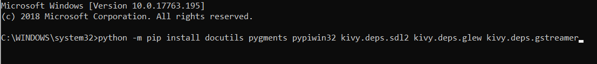
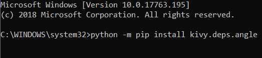
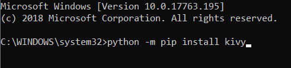
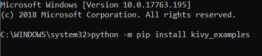

# Belajar Kivy dengan OOP Python


Kivy adalah library Python untuk membuat aplikasi untuk berbagai platform. Kivy bisa dijalankan pada Windows, Linux, OS X, Android, iOS, dan Raspberry Pi.

Kivy Mempunyai banyak kelebihan seperti:
1. Pembuatan dan pengembangan Aplikasi Cross-platform.
2. Support di berbagai jenis OS di antaranya Windows, Linux, OS X, Android dan iOS.
3. Menggunakan OpenGL ES sebagai graphics engine-nya.
4. Menggunakan bahasa Python yang mudah digunakan sangat cocok bagi pemula.
5. Di lengkapi 3rd party Python library.

disamping mempunyai banyak kelebihan kivy juga memiliki beberapa kekurangan seperti:
1. Tidak memiliki 100% API support pada iOS (plyer) hanya yang menggunakan MIT license.
2. Waktu saat pemakain agak sedikit lebih lama dari pada aplikasi native dikarenakan menggunakan wrapper dan Python.
3. Memiliki performa dibawah aplikasi native, namun tidak akan terasa jika hanya sebatas game atau aplikasi yang ringan.

Untuk memulai belajar Kivy dengan Menggunakan OOP Python, kita harus menginstall library Kivy terlebih dahulu.

## Instalasi Kivy
Untuk menginstall Kivy, kita harus mempersiapkan Python versi 2.7 atau 3.4 keatas, karena Kivy hanya tersedia pada beberapa versi Python tersebut.

### Instalasi pada Windows
- Dengan menggunakan paket manager [pip](https://pip.pypa.io/en/stable/) untuk menginstall Kivy.
- Buka Command Prompt (CMD) Windows sebagai administrator.

 

- Pastikan anda menginstall pip dan wheel versi terbaru
```bash
python -m pip install --upgrade pip wheel setuptools
```
 

- Kemudian install dependencies
```bash
python -m pip install docutils pygments pypiwin32 kivy.deps.sdl2 kivy.deps.glew kivy.deps.gstreamer
```

 

- untuk python 3.5 keatas, anda juga bisa menginstall angle
```bash
python -m pip install kivy.deps.angle
```

 

- kemudian install kivy
```bash
python -m pip install kivy
```

 

- kemudian install kivy examples(contoh program kivy)(opsional) untuk memastikan kivy sudah terinstall dengan baik.
```bash
python -m pip install kivy_examples
```

 
