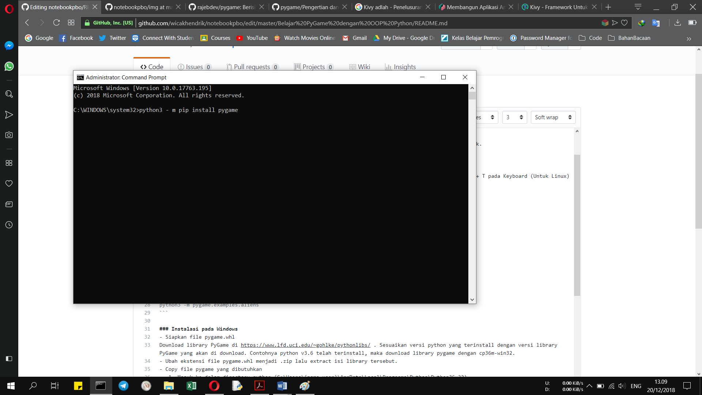
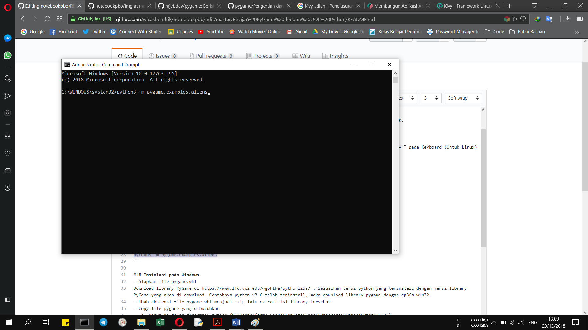

# Belajar PyGame dengan OOP Python


## Pengertian PyGame
PyGame adalah library Python untuk membuat aplikasi multimedia khususnya game.
Untuk memulai belajar PyGame dengan Menggunakan OOP Python, kita harus menginstall library PyGame terlebih dahulu.

## Instalasi PyGame
Untuk menginstall PyGame sebaiknya gunakan Python versi 3.6.1 atau yang tebaru untuk hasil yang lebih baik.

### Instalasi menggunakan pip
- Dengan menggunakan paket manager [pip](https://pip.pypa.io/en/stable/) untuk menginstall PyGame.
- Buka Command Prompt (CMD) Windows sebagai administrator (Untuk Windows), atau buka Terminal/Tekan Ctrl + T pada Keyboard (Untuk Linux)


kemudian ketikkan :
```bash
python -m pip install --upgrade pip
```


lalu enter untuk upgrade pip nya dulu, lalu install pygame dengan mengetik sebagai berikut:
```bash
pip3 install pygame
```


lalu enter, atau bisa juga
```bash
python3 - m pip install pygame
```


lalu enter, untuk mengecek instalasi berhasil atau tidak, coba jalankan :
```bash
python3 -m pygame.examples.aliens
```


lalu enter.

### Instalasi pada Windows
- Siapkan file pygame.whl
Download library PyGame di https://www.lfd.uci.edu/~gohlke/pythonlibs/ . Sesuaikan versi python yang terinstall dengan versi library PyGame yang akan di download. Contohnya python v3.6 telah terinstall, maka download library pygame dengan cp36m-win32.
- Ubah ekstensi file pygame.whl menjadi .zip lalu extract isi library tersebut.
- Copy file pygame yang dibutuhkan
   1. Masuk ke dalam directory python (C:\Users\(nama user)\AppData\Local\Programs\Python\Python36-32)
   2. Masuk kedalam folder “include” dan buat folder baru bernama “pygame”.
   3. Di dalam folder hasil extract file library pygame yang sudah didownload, masuk ke “pygame-1.9.4.data\header”, copy semua file di         dalam folder tersebut dan masukkan ke dalam folder: C:\Users\(nama user)\AppData\Local\Programs\Python\Python36-32\include\pygame
   4. kembali ke folder hasil extract file library pygame tadi, copy folder “pygame” dan “pygame-1.9.4.dist-info” kedalam:          C:\Users\#username\AppData\Local\Programs\Python\Python35-32\Lib\site-packages
- Cek hasil installasi
Untuk mengecek hasil instalasi, buka IDLE Python lalu lakukan perintah “import pygame”, jika tidak ada tulisan error maka pygame sudah berhasil terinstall.

NB : bisa juga menginstall menggunakan paket manager [pip](https://pip.pypa.io/en/stable/) seperti cara penginstalan diatas.

### Instalasi pada Linux
#### - Instalasi pada Linux berbasis Debian (Debian/Ubuntu/Mint, dll)
Buka Terminal (Ctrl + T)
ketikkan : 
```bash
sudo apt-get install python3-pygame
```
atau bisa juga menginstall menggunakan paket manager [pip](https://pip.pypa.io/en/stable/) seperti cara penginstalan diatas.
untuk mengecek instalasi berhasil atau tidak, coba jalankan :
```bash
python3 -m pygame.examples.aliens
```
#### - Instalasi pada Linux berbasis Fedora/RedHat
Buka Terminal (Ctrl + T)
ketikkan : 
```bash
sudo yum install python3-pygame
```
atau bisa juga menginstall menggunakan paket manager [pip](https://pip.pypa.io/en/stable/) seperti cara penginstalan diatas.
untuk mengecek instalasi berhasil atau tidak, coba jalankan :
```bash
python3 -m pygame.examples.aliens
```
### Instalasi pada Mac OS
- Buka terminal / command prompt Mac OS
- kemudian ketikkan baris perintah dibawah ini untuk membuat virtualenv bernama anenv kemudian aktifkan virtualenv tersebut
```bash
python3 -m virtualenv anenv
. ./anenv/bin/activate
```
- kemudian install venvdotapp dan pygame
```bash
python -m pip install venvdotapp
venvdotapp
python -m pip install pygame
```
- untuk mengecek instalasi berhasil atau tidak, coba jalankan :
```bash
python3 -m pygame.examples.aliens
```
Setelah berhasil menginstall PyGame, maka tahap selanjutnya adalah mencoba Game yang sudah kami buat yaitu game ShooterPro, silahkan mendownload kemudian mencoba game ShooterPro pada folder ShooterPro diatas. Kemudian membaca Dokumentasi OOP yang dipakai dalam game ShooterPro ini.
